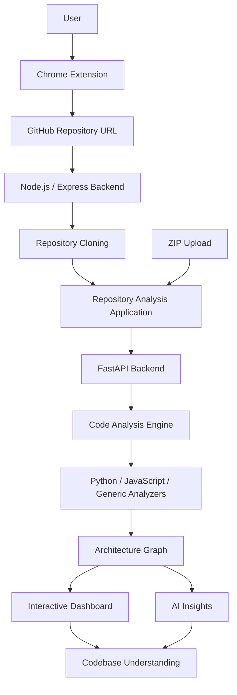

# CodeBase Xray


CodeBase Xray is a developer tool that transforms unfamiliar software repositories into interactive architectural visualizations and AI-powered insights.

Available as a Chrome extension with a companion web application, it allows developers to analyze GitHub repositories or upload ZIP archives to explore their internal structure, understand component relationships, and gain insights into how an application works.

Instead of manually navigating through hundreds of files, developers can visualize the codebase as an interconnected graph and use AI-assisted explanations to understand its architecture.

---

## Overview

Understanding an unfamiliar codebase is one of the biggest challenges developers face when joining an existing project or exploring open-source software.

Manually identifying entry points, tracing imports, understanding dependencies, and figuring out how different modules interact can be tedious and time-consuming.

**CodeBase Xray addresses this challenge by automating codebase exploration.**

It combines static code analysis, graph-based architecture visualization, and AI-powered explanations to provide developers with a structured overview of unfamiliar projects.

## Features

### 1. Repository Analysis

* Analyze public GitHub repositories using their repository URLs.
* Upload locally stored projects through ZIP archives.
* Clone and inspect repository contents for structural analysis.

### 2. Architecture Visualization

* Generate interactive graph-based representations of software architecture.
* Identify files, classes, functions, modules, services, models, and API endpoints.
* Visualize relationships such as imports, calls, inheritance, and component dependencies.
* Explore individual nodes and their connections.

### 3. Multi-Language Code Analysis

* Python source code analysis.
* JavaScript and TypeScript source code analysis.
* Generic structural analysis for additional file types.
* Identification of important architectural components and relationships.

### 4. AI-Powered Insights

* Generate high-level explanations of repository architecture.
* Understand the purpose and role of individual components.
* Explore code-quality observations.
* Examine dependency-related insights.
* Get explanations of how different components contribute to the overall system.

### 5. Interactive Exploration

* Navigate through the generated architecture graph.
* Select individual nodes to inspect their details.
* Explore connected components and relationships.
* Access contextual AI explanations.

---

## Architecture

CodeBase Xray consists of three major parts:

* **Chrome Extension:** Provides the browser-based entry point for submitting GitHub repositories and accessing the analysis application.
* **Backend Services:** Handle repository retrieval, ZIP processing, metadata extraction, code analysis, and AI requests.
* **Analysis Dashboard:** Displays the generated architecture graph, component details, and AI-powered insights.

### System Workflow



---

## Technology Stack

| Technology       | Role                                      |
| ---------------- | ----------------------------------------- |
| Python           | Static code analysis and graph generation |
| FastAPI          | Analysis application backend              |
| JavaScript       | Chrome extension and interactive frontend |
| Node.js          | Extension-side backend                    |
| Express.js       | Backend API services                      |
| HTML5 & CSS3     | User interface                            |
| Groq API         | AI-powered repository analysis            |
| Ollama           | Local AI model integration                |
| Git / Simple Git | Repository cloning                        |
| Axios            | HTTP communication                        |

---

## How It Works

### Repository Processing

Users can provide a GitHub repository URL through the Chrome extension or submit a ZIP archive through the analysis application.

### Static Code Analysis

The analysis engine processes source files and extracts relevant structural information.

Depending on the language, specialized analyzers identify:

* Classes and functions.
* Imports and dependencies.
* API routes and endpoints.
* Models and services.
* Database operations.
* Component relationships.

### Graph Generation

Extracted information is represented using a graph structure consisting of:

* **Nodes:** Files, classes, functions, endpoints, models, services, and other architectural elements.
* **Edges:** Relationships such as imports, calls, inheritance, API calls, and database operations.

The resulting graph is serialized and provided to the frontend for visualization.

### AI-Assisted Understanding

The AI panel uses the generated repository context to provide architectural explanations, node-level insights, code-quality observations, and dependency analysis.

---

## Project Structure

```text
codebase-xray/
│
├── Popup/
│   ├── Backend/
│   │   ├── server.js
│   │   └── package.json
│   │
│   └── Frontend/
│       ├── manifest.json
│       ├── popup.html
│       ├── popup.css
│       └── popup.js
│
└── Website/
    ├── backend/
    │   ├── app.py
    │   └── analyzer/
    │       ├── graph.py
    │       ├── orchestrator.py
    │       ├── python_analyzer.py
    │       ├── js_analyzer.py
    │       └── generic_analyzer.py
    │
    └── frontend/
        └── js/
            ├── app.js
            └── ai-panel.js
```

---

## Getting Started

### Prerequisites

* Python
* Node.js and npm
* Git
* Google Chrome
* Groq API key for the extension backend
* Ollama and a supported local model for local AI functionality

### Clone the Repository

```bash
git clone https://github.com/Prankyche/codebase-xray.git

cd codebase-xray
```

### Set Up the Extension Backend

```bash
cd Popup/Backend

npm install
```

Configure the required environment variables in a `.env` file, including the Groq API key.

Start the backend using the appropriate server startup command.

### Set Up the Analysis Backend

```bash
cd Website/backend

pip install -r requirements.txt
```

Configure the required environment variables and start the FastAPI application using the project's ASGI entry point.

### Load the Chrome Extension

1. Open Google Chrome.
2. Navigate to `chrome://extensions/`.
3. Enable Developer Mode.
4. Select **Load unpacked**.
5. Choose the `Popup/Frontend` directory.
6. The CodeBase Xray extension will be available in Chrome.

> Note: The extension and analysis application use separate backend services. Ensure both required services are running and their configured URLs and ports are consistent before using the complete workflow.

---

## Use Cases

* **Developer Onboarding:** Understand unfamiliar repositories before contributing.
* **Open-Source Exploration:** Explore the internal architecture of public GitHub projects.
* **Codebase Navigation:** Identify important files, functions, and dependencies.
* **Software Architecture Learning:** Visualize how application components interact.
* **Code Review:** Gain structural context when examining unfamiliar projects.

---

## Future Enhancements

* Expand language support and improve cross-language dependency resolution.
* Add deeper execution-flow and data-flow visualization.
* Introduce automated architectural documentation generation.
* Improve code-quality and security analysis.
* Support architecture comparison across different repository versions.
* Enable exportable architecture diagrams and analysis reports.

---

## Contributing

Contributions and suggestions are welcome!

1. Fork the repository.
2. Create a feature branch.
3. Implement your changes.
4. Commit and push your changes.
5. Submit a Pull Request.

---
